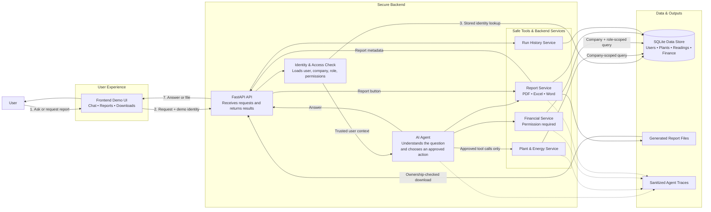

# Presentation Architecture Diagram

[Open the presentation SVG](architecture-diagram.svg)

## Editable Mermaid source

## How to explain the diagram

1. The **user** asks a question or requests a report in the browser.
2. The **Frontend Demo UI** sends the question and selected demo identity to
   FastAPI. It never sends a company ID.
3. The **FastAPI API** coordinates the request. The **Identity & Access Check**
   loads the stored user and creates trusted company and permission context.
4. For chat, the **AI Agent** understands the request and can select only the
   tools it was given. It has no SQL, database, filesystem, or shell tool.
5. **Safe Tools & Backend Services** perform fixed operations:
   - plant and energy summaries;
   - financial summaries after a financial permission check;
   - owned PDF, Excel, and Word report generation;
   - owned run-result storage and recovery.
6. Services—not the AI—query the **SQLite Data Store**. Every query is
   restricted to the trusted company. Report files are generated server-side,
   and agent traces contain only sanitized event metadata.
7. The API returns an answer or an ownership-checked download to the frontend.

## Security messages to highlight

- Access is determined inside the backend from the stored user.
- The AI agent cannot query the database directly.
- Company isolation and financial permissions are rechecked by services.
- Reports are generated and downloaded through server-side ownership checks.

For a shorter executive version, hide the four individual service boxes and
show only one **Safe Tools & Services** box. For a technical version, add the
individual SQLAlchemy models and composite tenant foreign keys under the data
store; those details are intentionally omitted from the presentation diagram.
