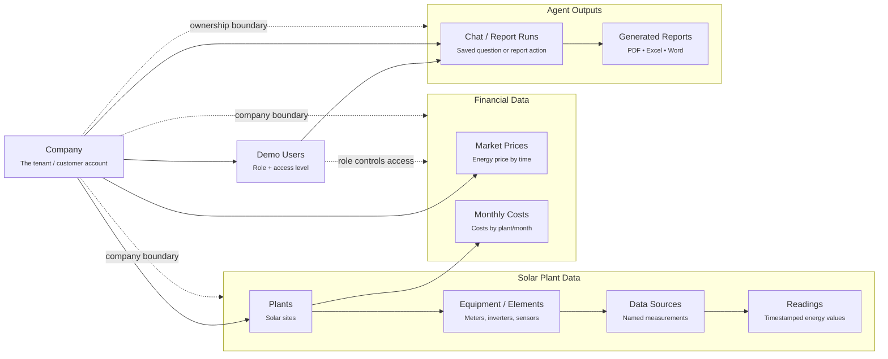

# Data Structure Diagram

[Open the presentation SVG](data-structure-diagram.svg)

## Simple presentation diagram



## How to explain it

The data starts with a **Company**. Every important record belongs to one
company, so users from another company cannot see it.

Each company has **Users**. A user has a role and access level. Some users can
see only energy data. Admin/financial users can also see market prices and
costs.

The operational data follows the solar plant hierarchy:

```text
Company → Plants → Equipment → Data Sources → Readings
```

For example, a plant can have meters or sensors. Those devices expose data
sources such as “Total meter energy.” The readings are timestamped values used
for questions like “How much energy did plant 1001 produce in March?”

Financial data is separate:

- **Market Prices** belong to a company and are financial-only.
- **Monthly Costs** belong to a company and plant and are financial-only.

Agent activity is stored separately:

- **Chat / Report Runs** record the user’s completed action.
- **Generated Reports** are linked to the company, user, and run that created
  them.

## Key messages for non-technical audiences

- Company data is separated by design.
- User role decides whether financial data is visible.
- The AI does not own the data; backend services fetch scoped data for it.
- Reports are tied to the company, user, and run that created them.

## Slightly more technical interpretation

The actual database stores tenant-owned rows with `company_id`. Child records
use company-qualified relationships so a reading, datasource, element, cost,
run, or document cannot be linked across companies. Downloads are checked by
company, user, run, and document ownership.
